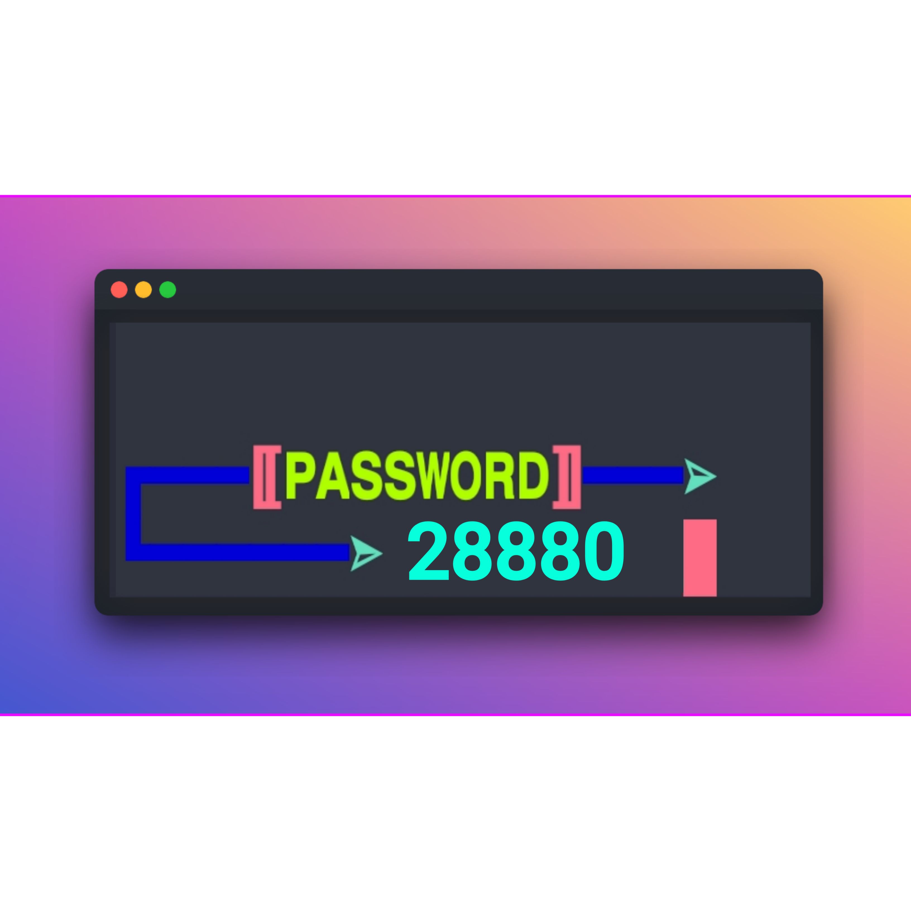

<p align="center">
    
</p>

<p align="center">
<a href="https://instagram.com/mohammad_arif_hasnain/"></a>
</p>

<p align="center">
<a href="https://instagram.com/mohammad_arif_hasnain"></a>
<a href="https://youtube.com/channel/UCZZqPRa6GkB4prE3pgynW5w"></a>
<a href="https://youtube.com/channel/UCZZqPRa6GkB4prE3pgynW5w"></a>
</p>

<p align="center">
<a href="https://github.com/T0XIC-CYBER"></a>
<a href="https://youtube.com/channel/UCZZqPRa6GkB4prE3pgynW5w"></a>
</p>
<p align="center">
<a href="https://github.com/T0XIC-CYBER"></a>
<a href="https://github.com/T0XIC-CYBER"></a>
<a href="https://github.com/T0XIC-CYBER"></a>
<a href="https://github.com/T0XIC-CYBER"></a>
<a href="https://github.com/T0XIC-CYBER"></a>

</p>

Remove old `Repository`

```
rm -rf CIRCLE-TOOLS
```

## Run `git`

```
git clone https://github.com/T0XIC-CYBER/CIRCLE-TOOLS
```

## Run Script 

```
cd CIRCLE-TOOLS
```
```
python CIRCLE.py
```
### Password 🔓

<p align="center">
    
</p>
<p align="center">
    
</p>
<p align="center">
    
</p>
